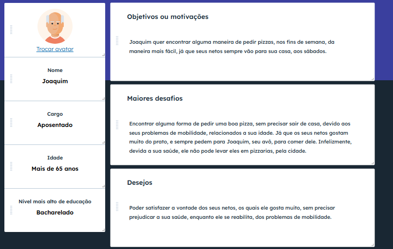

# Introdução

A FatiaCerta, pizzaria de bairro que atua com delivery recentemente criada e em operação tem passado por dificuldades por conta do aumento de clientes e poucos funcionários para atender a crescente demanda dos clientes em relação a suas pizzas. A partir disso, montaram um setor de TI buscando o desenvolvimento de um aplicativo web e mobile para que seus clientes e funcionários possam ter maior controle e informação sobre os pedidos e uma forma mais fácil de se consultar o cardápio da pizzaria a hora que desejarem, além de ser uma boa ajuda na divulgação da loja demonstrando sua preocupação em se modernizar e cada vez mais aumentar sua clientela.

## Problema
A pizzaria FatiaCerta, recentemente passa por dificuldades e ineficiência em seu sistema de realização de pedidos, como: 
- Dificuldades no atendimento em horários de pico,
- Ligações congestionadas,
- Ocorrem erros na comunicação com os clientes durante as ligações em relação a sabores, adicionais e promoções.
  
Com essa necessidade de se modernizar e atender melhor seus clientes, decidiram realizar o desenvolvimento de um aplicativo mobile e um site Web por meio de seu setor de TI onde os clientes irão poder ver os itens disponíveis para pedir e acompanhar o processo pelo status do pedido, além de ter a opção de escolher a forma do pagamento. Os funcionários da pizzaria poderão aceitar e recusar os pedidos, além de poderem atualizar o status dos respectivos pedidos para o cliente.

## Objetivos

### Objetivo Geral
Desenvolver um sistema de delivery para pizzaria que ofereça ao cliente uma experiência simples, rápida e personalizada. Além disso, conforme demonstrado no problema, o sistema também deverá otimizar o processo interno da pizzaria, reduzindo erros de comunicação, melhorando a organização dos pedidos e possibilitando aos funcionários maior agilidade no atendimento e controle.

### Objetivo Específicos
1. Implementar uma plataforma digital de pedidos que permita ao cliente visualizar o cardápio, personalizar produtos e acompanhar o status da entrega.
2. Investigar a experiência dos usuários em relação à usabilidade da plataforma. 

## Justificativa
O desenvolvimento de um sistema de delivery de pizzaria se justifica pela crescente demanda dos consumidores por praticidade, rapidez e comodidade no acesso a serviços alimentícios. Atualmente, o hábito de realizar pedidos online vem se consolidando como uma preferência, sobretudo em áreas urbanas, onde o tempo disponível é limitado e a convêniencia se torna fator decisivo

Para a pizzaria, a implantação de um sistema de delivery possibilita ampliar sua base de clientes, aumentar o volume de vendas e otimizar o processo de atendimento, reduzindo falhas ocasionadas por pedidos realizados via telefone, como erros de comunicação ou atrasos. 

Do ponto de vista dos clientes, o sistema oferece uma experiência mais ágil e personalizada, com acesso ao cardápio completo, promoções e opções de customização, fortalecendo a fidelização e a competitividade da pizzaria no mercado

## Público-Alvo

Pessoas, entre 18 e 70 anos, com renda suficiente para comer fora de casa, que desejam ficar no conforto de sua residência, e, ainda assim, aproveitar uma boa pizza, como se estivessem em um restaurante. Esses indivíduos precisam saber utilizar, de maneira básica, um aparelho de tecnologia, o mais comum sendo um smartphone, e ter acesso a uma conexão de internet, para conseguirem acessar o aplicativo. 

### Personas

### Mapa de stakeholders

|Stakeholder     | Interesse  |Influência | Estratégia de engajamento
|-------|-----------|----|--------------------|
|Cliente| Alto | Alta | Escutar os desejos e sugestões, para melhorar o aplicativo
|Equipe de desenvolvimento| Alto |  Média | Se comunicar constantemente, para organizar o projeto de maneira eficaz
|Restaurantes| Alto | Alta | Sempre escutar as sugestões, para eles não irem utilizar outro app
|Investidores| Médio | Alta | Manter informados com relatórios, para eles poderem acompanhar o crescimento do app

# Especificações do Projeto

## Requisitos

As tabelas que se seguem apresentam os requisitos funcionais e não funcionais que detalham o escopo do projeto. Para determinar a prioridade de requisitos, aplicar uma técnica de priorização de requisitos e detalhar como a técnica foi aplicada.

### Requisitos Funcionais

|ID    | Descrição do Requisito  | Prioridade |
|------|-----------------------------------------|----|
|RF-001| Gestão de usuário | ALTA | 
|RF-002| Visualização de cardápio | ALTA |
|RF-003| Carrinho | ALTA |
|RF-004| Gerenciamento do cardápio   | ALTA |
|RF-005| Monitoramento do Pedido  | MÉDIA |
|RF-006| Pedidos  | ALTA |
|RF-007| Personalização de pedidos | MÉDIA |

### Requisitos não Funcionais

|ID     | Descrição do Requisito  |Prioridade |
|-------|-------------------------|----|
|RNF-001| O sistema deve ser responsivo para rodar em um dispositivos móvel | ALTA | 
|RNF-002| Deve processar requisições do usuário em no máximo 3s |  BAIXA | 
|RNF-003| Sistema deve fornecer uma boa usabilidade |  MÉDIA | 
|RNF-004| Sistema deve apresentar uma criptografia no banco de dados para melhor segurança|  ALTA | 
|RNF-005| terá que ser compativel com os sistemas IOS e Android  |  ALTA | 
|RNF-006| Deverá ter uma alta disponibilidade porcentagem |  MÉDIA | 

## Restrições

O projeto está restrito pelos itens apresentados na tabela a seguir.

|ID     | Restrição  |Prioridade |
|-------|-------------------------|----|
|RNF-001| O projeto deve ser entregue no prazo estipulado | ALTA | 
|RNF-002| O projeto não deve ter subsídio de nenhuma espécie | ALTA |

## Catálogo de Serviços

- Cadastro de usuários: Clientes, e os donos do restaurante, poderão realizar o seu cadastro, com email e senha, para conseguirem utilizar o aplicativo.

- Login de usuários: Usuários, já cadastrados, poderão entrar no aplicativo, utilizando o seu email e senha, fornecidos no cadastro.

- Atualização do perfil : Donos do restaurante, e clientes, poderão atualizar os seus respectivos perfis.

- Cadastro de items: Donos do restaurante poderão cadastrar items, existentes no seu menu, para os clientes conseguirem adquiri-los, por meio de pedidos.

- Atualização de items: Os donos do restaurante conseguirão editar items existentes, para poder realizar atualizações necessárias.

- Remoção de items: Os donos do restaurante terão a opção de remover um item, das opções existentes, caso ele pare de ser vendido.

- Realização de pedidos: Clientes vão poder fazer pedidos, de algum item existente, publicado pelo restaurante, para receber ele em sua residência.

- Acompanhar o status do pedido, clientes: Clientes poderão acompanhar o status do seu pedido, que será dividido em: "Não aceito", "Aceito", "Em preparo", "Em rota de entrega" e "Entregue". Possibilitando assim, o cliente de saber se o restaurante vai realizar a entrega, para ele poder tomar alguma providência, dependendo do status atual.

- Acompanhar os pedidos realizados, restaurante: Os donos do restaurante conseguirão ver uma lista dos pedidos realizados, feitos pelos clientes, para fazerem o seu preparo e envio. Além de conseguirem atualizar o status do pedido, para os já citados em "Acompanhar o status do pedido".

# Arquitetura da Solução
      +--------------------+           +--------------------+
      |      Web App       |           |     Mobile App     |
      | (React + Tailwind) |           | (React Native +    |
      |                    |           |     Tailwind)      |
      +---------+----------+           +---------+----------+
                \                               /
                 \                             /
                  \                           /
                   \                         /
                    v                       v

            +----------------------------------+
            |               API                | (Desenvolvido em .NET)
            +----------------------------------+
            |          Authentication          | <-- Valida JWT de clientes e cozinheiros
            +----------------------------------+
            |         Serviços de Negócio      |
            |                                  |
            |   +---------------------------+  |
            |   | Gestão de Usuários        |  | <-- CRUD de usuários + login
            |   +---------------------------+  |
            |                                  |
            |   +---------------------------+  |
            |   | Gestão de Pedidos         |  | <-- CRUD de pedidos
            |   +---------------------------+  |
            |                                  |
            |   +---------------------------+  |
            |   | Gestão de Cardápio        |  | <-- CRUD de cardápio
            |   +---------------------------+  |
            |                                  |
            |   +---------------------------+  |
            |   | Gestão de Entregas        |  | <-- Roteirização, status, confirmação
            |   +---------------------------+  |
            +----------------------------------+

                            |
                            v

                  +--------------------+
                  |  Banco de dados    | (SQL Server)
                  +--------------------+

## Tecnologias Utilizadas

Para desenvolver o sistema de delivery da pizzaria foram escolhidas tecnologias simples, mas eficientes:

### Front end
Linguagem: JavaScript

Framework: React para Web, e React native para mobile

Estilo: Tailwind CSS (deixa o app bonito e responsivo)

### Back end

Linguagem: C#

Framework: ASP .NET CORE

Banco de dados: SQL server

Autenticação: JWT  usando Microsoft.AspNetCore.Authentication.JwtBearer

## Hospedagem

O front end será hospedado no Vercel, que é simples de usar e integrado ao GitHub.

Cada vez que o código for atualizado, a plataforma gera automaticamente uma nova versão do site.

A API será hospedada na AWS.

# Planejamento

##  Quadro de tarefas

> Apresente a divisão de tarefas entre os membros do grupo e o acompanhamento da execução, conforme o exemplo abaixo.

### Semana 1

Atualizado em: 21/04/2024

| Responsável   | Tarefa/Requisito | Iniciado em    | Prazo      | Status | Terminado em    |
| :----         |    :----         |      :----:    | :----:     | :----: | :----:          |
| AlunaX        | Introdução | 01/02/2024     | 07/02/2024 | ✔️    | 05/02/2024      |
| AlunaZ        | Objetivos    | 03/02/2024     | 10/02/2024 | 📝    |                 |
| AlunoY        | Histórias de usuário  | 01/01/2024     | 07/01/2005 | ⌛     |                 |
| AlunoK        | Personas 1  |    01/01/2024        | 12/02/2005 | ❌    |       |

#### Semana 2

Atualizado em: 21/04/2024

| Responsável   | Tarefa/Requisito | Iniciado em    | Prazo      | Status | Terminado em    |
| :----         |    :----         |      :----:    | :----:     | :----: | :----:          |
| AlunaX        | Página inicial   | 01/02/2024     | 07/03/2024 | ✔️    | 05/02/2024      |
| AlunaZ        | CSS unificado    | 03/02/2024     | 10/03/2024 | 📝    |                 |
| AlunoY        | Página de login  | 01/02/2024     | 07/03/2024 | ⌛     |                 |
| AlunoK        | Script de login  |  01/01/2024    | 12/03/2024 | ❌    |       |

Legenda:
- ✔️: terminado
- 📝: em execução
- ⌛: atrasado
- ❌: não iniciado
