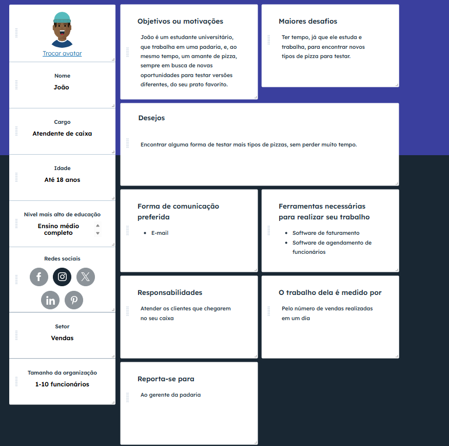

# Introdução

Texto descritivo com a visão geral do projeto abordado. Inclui o contexto, o problema, os objetivos, a justificativa e o público-alvo do projeto.

## Problema
Nesse momento você deve apresentar o problema que a sua aplicação deve  resolver. No entanto, não é a hora de comentar sobre a aplicação.

Descreva também o contexto em que essa aplicação será usada, se  houver: empresa, tecnologias, etc. Novamente, descreva apenas o que de  fato existir, pois ainda não é a hora de apresentar requisitos  detalhados ou projetos.

Nesse momento, o grupo pode optar por fazer uso  de ferramentas como Design Thinking, que permite um olhar de ponta a ponta para o problema.

> **Links Úteis**:
> - [Objetivos, Problema de pesquisa e Justificativa](https://medium.com/@versioparole/objetivos-problema-de-pesquisa-e-justificativa-c98c8233b9c3)
> - [Matriz Certezas, Suposições e Dúvidas](https://medium.com/educa%C3%A7%C3%A3o-fora-da-caixa/matriz-certezas-suposi%C3%A7%C3%B5es-e-d%C3%BAvidas-fa2263633655)
> - [Brainstorming](https://www.euax.com.br/2018/09/brainstorming/)

## Objetivos

### Objetivo Geral
Desenvolver um sistema de delivery de pizzaria para resolver o problema apresentado acima

### Objetivo Específicos
1. Implementar uma plataforma digital de pedidos que permita ao cliente visualizar o cardápio, personalizar produtos e acompanhar o status da entrega.
2. Investigar a experiência dos usuários em relação à usabilidade da plataforma. 

## Justificativa
O desenvolvimento de um sistema de delivery de pizzaria se justifica pela crescente demanda dos consumidores por praticidade, rapidez e comodidade no acesso a serviços alimentícios. Atualmente, o hábito de realizar pedidos online vem se consolidando como uma preferência, sobretudo em áreas urbanas, onde o tempo disponível é limitado e a convêniencia se torna fator decisivo

Para a pizzaria, a implantação de um sistema de delivery possibilita ampliar sua base de clientes, aumentar o volume de vendas e otimizar o processo de atendimento, reduzindo falhas ocasionadas por pedidos realizados via telefone, como erros de comunicação ou atrasos. 

Do ponto de vista dos clientes, o sistema oferece uma experiência mais ágil e personalizada, com acesso ao cardápio completo, promoções e opções de customização, fortalecendo a fidelização e a competitividade da pizzaria no mercado

## Público-Alvo

Pessoas, entre 18 e 70 anos, com renda suficiente para comer fora de casa, que desejam ficar no conforto de sua residência, e, ainda assim, aproveitar uma boa pizza, como se estivessem em um restaurante. Esses indivíduos precisam saber utilizar, de maneira básica, um aparelho de tecnologia, o mais comum sendo um smartphone, e ter acesso a uma conexão de internet, para conseguirem acessar o aplicativo. 

### Personas

### Mapa de stakeholders

|Stakeholder     | Interesse  |Influência | Estratégia de engajamento
|-------|-----------|----|--------------------|
|Cliente| Alto | Alta | Escutar os desejos e sugestões, para melhorar o aplicativo
|Equipe de desenvolvimento| Alto |  Média | Se comunicar constantemente, para organizar o projeto de maneira eficaz
|Restaurantes| Alto | Alta | Sempre escutar as sugestões, para eles não irem utilizar outro app
|Investidores| Médio | Alta | Manter informados com relatórios, para eles poderem acompanhar o crescimento do app

# Especificações do Projeto

## Requisitos

As tabelas que se seguem apresentam os requisitos funcionais e não funcionais que detalham o escopo do projeto. Para determinar a prioridade de requisitos, aplicar uma técnica de priorização de requisitos e detalhar como a técnica foi aplicada.

### Requisitos Funcionais

|ID    | Descrição do Requisito  | Prioridade |
|------|-----------------------------------------|----|
|RF-001| Cadastro e autenticação de usuário | ALTA | 
|RF-002| Perfil do usuário   | ALTA |
|RF-003| Visualização de cardápio   | ALTA |
|RF-004| Carrinho e pedidos   | ALTA |
|RF-005| Pagamento   | ALTA |
|RF-006| Acompanhamento do pedido   | MÉDIA |
|RF-007| Suporte e atendimento   | ALTA |
|RF-008| Gerenciamento do cardápio   | ALTA |
|RF-009| Relatórios e análises constante  | BAIXA |
|RF-010| Monitoramento do Pedido  | MÉDIA |
|RF-011| Gestão Financeira   | MÉDIA |
|RF-012| Gestão de estoque   | BAIXA |
|RF-013| Gerenciamento de Usuários   | MÉDIA |
|RF-014| Cadastro e validação de motorista   | MÉDIA |
|RF-015| Gestão de Entregas   | MÉDIA |
|RF-016| Comunicação via chat   | MÉDIA |
|RF-017| Navegação e Rota   | MÉDIA |

### Requisitos não Funcionais

|ID     | Descrição do Requisito  |Prioridade |
|-------|-------------------------|----|
|RNF-001| O sistema deve ser responsivo para rodar em um dispositivos móvel | MÉDIA | 
|RNF-002| Deve processar requisições do usuário em no máximo 3s |  BAIXA | 

Com base nas Histórias de Usuário, enumere os requisitos da sua solução. Classifique esses requisitos em dois grupos:

- [Requisitos Funcionais
 (RF)](https://pt.wikipedia.org/wiki/Requisito_funcional):
 correspondem a uma funcionalidade que deve estar presente na
  plataforma (ex: cadastro de usuário).
- [Requisitos Não Funcionais
  (RNF)](https://pt.wikipedia.org/wiki/Requisito_n%C3%A3o_funcional):
  correspondem a uma característica técnica, seja de usabilidade,
  desempenho, confiabilidade, segurança ou outro (ex: suporte a
  dispositivos iOS e Android).
Lembre-se que cada requisito deve corresponder à uma e somente uma
característica alvo da sua solução. Além disso, certifique-se de que
todos os aspectos capturados nas Histórias de Usuário foram cobertos.

## Restrições

O projeto está restrito pelos itens apresentados na tabela a seguir.

|ID| Restrição                                             |
|--|-------------------------------------------------------|
|01| O projeto deverá ser entregue até o final do semestre |
|02| Não pode ser desenvolvido um módulo de backend        |

Enumere as restrições à sua solução. Lembre-se de que as restrições geralmente limitam a solução candidata.

> **Links Úteis**:
> - [O que são Requisitos Funcionais e Requisitos Não Funcionais?](https://codificar.com.br/requisitos-funcionais-nao-funcionais/)
> - [O que são requisitos funcionais e requisitos não funcionais?](https://analisederequisitos.com.br/requisitos-funcionais-e-requisitos-nao-funcionais-o-que-sao/)

# Catálogo de Serviços

Descreva aqui todos os serviços que serão disponibilizados pelo seu projeto, detalhando suas características e funcionalidades.

# Arquitetura da Solução

Definição de como o software é estruturado em termos dos componentes que fazem parte da solução e do ambiente de hospedagem da aplicação.

## Tecnologias Utilizadas

Para desenvolver o sistema de delivery da pizzaria foram escolhidas tecnologias simples, mas eficientes:

Linguagem: JavaScript

Framework: React (para a interface do usuário)

Estilo: Tailwind CSS (deixa o app bonito e responsivo)

Banco de dados e autenticação: Firebase (armazenar pedidos, cardápio e login de clientes)

Hospedagem do site: Vercel (publicação rápida e automática do sistema)

Fluxo de Interação.

## Hospedagem

O sistema será hospedado no Vercel, que é simples de usar e integrado ao GitHub.

Cada vez que o código for atualizado, a plataforma gera automaticamente uma nova versão do site.

O banco de dados e a autenticação dos usuários ficam no Firebase, que funciona direto na nuvem.

Assim, o cliente acessa o aplicativo ou site pelo celular ou computador, e todos os dados são processados online.

# Planejamento

##  Quadro de tarefas

> Apresente a divisão de tarefas entre os membros do grupo e o acompanhamento da execução, conforme o exemplo abaixo.

### Semana 1

Atualizado em: 21/04/2024

| Responsável   | Tarefa/Requisito | Iniciado em    | Prazo      | Status | Terminado em    |
| :----         |    :----         |      :----:    | :----:     | :----: | :----:          |
| AlunaX        | Introdução | 01/02/2024     | 07/02/2024 | ✔️    | 05/02/2024      |
| AlunaZ        | Objetivos    | 03/02/2024     | 10/02/2024 | 📝    |                 |
| AlunoY        | Histórias de usuário  | 01/01/2024     | 07/01/2005 | ⌛     |                 |
| AlunoK        | Personas 1  |    01/01/2024        | 12/02/2005 | ❌    |       |

#### Semana 2

Atualizado em: 21/04/2024

| Responsável   | Tarefa/Requisito | Iniciado em    | Prazo      | Status | Terminado em    |
| :----         |    :----         |      :----:    | :----:     | :----: | :----:          |
| AlunaX        | Página inicial   | 01/02/2024     | 07/03/2024 | ✔️    | 05/02/2024      |
| AlunaZ        | CSS unificado    | 03/02/2024     | 10/03/2024 | 📝    |                 |
| AlunoY        | Página de login  | 01/02/2024     | 07/03/2024 | ⌛     |                 |
| AlunoK        | Script de login  |  01/01/2024    | 12/03/2024 | ❌    |       |

Legenda:
- ✔️: terminado
- 📝: em execução
- ⌛: atrasado
- ❌: não iniciado
